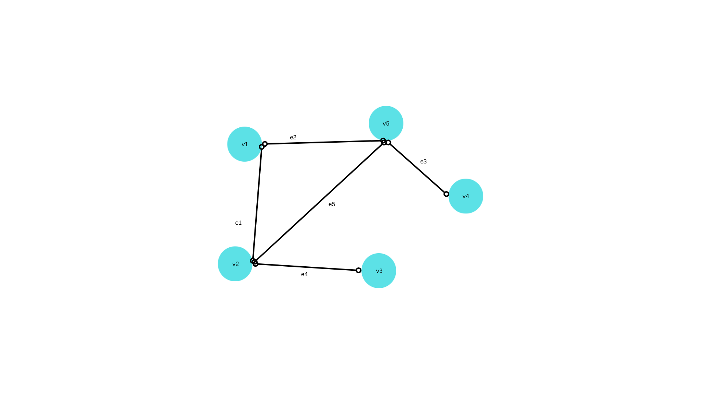
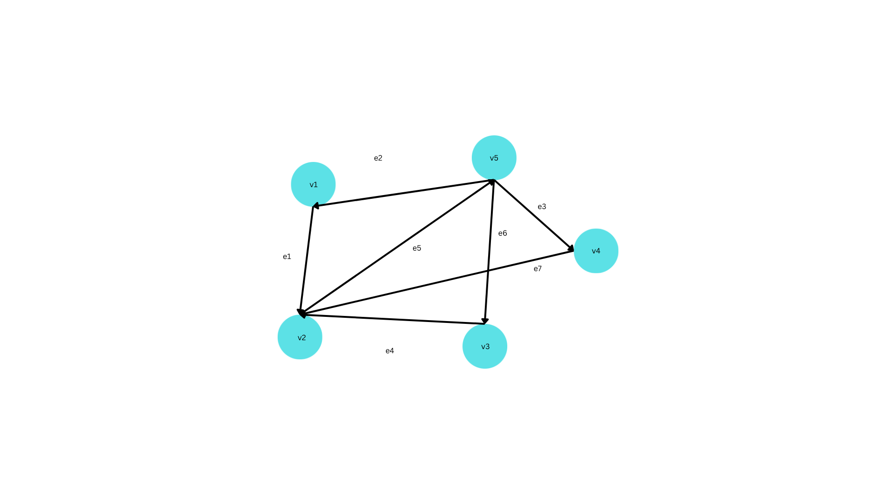

# Graphs

- [What is graph](#what-is-graph)
    - [Types of Graphs](#types-of-of-graphs)
        - [Undirected Graph](#undirected-graphs)
        - [Directed Graph](#directed-graphs)

----------

### What is graph

Graph is non-linear data structure. This data strucutre is used to represent relationship between pairs of elements, which are not necesarily hierarchical in nature. A graphs is defines as 

*"Graphs G is a ordered set (V, E), where V(G) represent the set of elements, called vertices, and E(G) represents the edges between these vertices."*

### Types of of Graphs

Graphs are of two types:

1. Undirected Graphs
2. Directed Graphs

### Undirected Graphs

In an Undirected graph, there is not specific direction associated with the edges. In general, in an undirected graph, an edges is represented by an *unordered* pair [u, v] (i.e. e = [u, v]), and that can be traversed from u toward v or vice versa.

In above figure shows a sample undirected  graph, for which *V(G)* = {v1, v2, v3, v4, v5}, and *E(G)* = {e1, e2, e3, e4, e5} i.e. there are five vertices and five edges in the graph.

### Directed Graphs

In the directed graph, an edge is represented by an *ordered* pair (u, v) = (i.e. = (u, v)), and that can be traversed only from a toward v.

----------

[Graph Terminology >>>](101-graph-terminology.md)