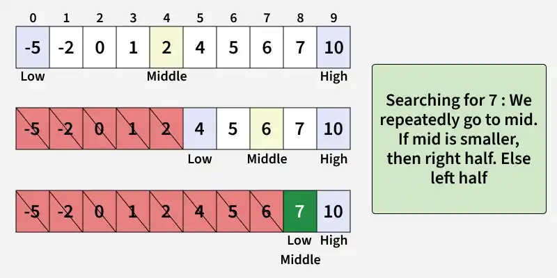

# Binary Search

Binary Search is a searching algorithm that operates on a sorted or monotonic search space, repeatedly dividing in into halves to find target value or optimal answer in logarithm time O(log N).



#### Conditions to apply Binary Search ALgorithm in a Data Structure.
- The data structure must be sorted.
- Access to any element of the data structure should take constant time.

#### Binary Search Algorithm
- Divide the search space into two halves by **finding the middle index "mid"**.
- Compare the middle of the search space with the **key**.
- If the **key** is found at middle, the process in terminated.
- If the **key** is not found at middle, choose which half will be used as the next search space.
    - IF the **key** is smaller than the middle, then the **left** side is used for the next search.
    - If the **key** is larger than the middle, then the **right** size is used for the next search.
- This process is continued untill the **key** is found or the total search space is exhausted.

### How to implemented Binary Search?
It can be implemented in the following two ways:
- Iterative Binary Search ALgorithm.
- Recursive Binary Serach Algorithm.

#### Iterative Algorithm: O(log n) TIme and O(1) Space

Here We use a while loop to continue the process of comparing the key and splitting the search space in two halves.

```py
def binarySearch(arr, x):
    low = 0
    high = len(arr) - 1
    while low <= high:

        mid = low + (high - low) // 2

        # Check if x is present at mid
        if arr[mid] == x:
            return mid

        # If x is greater, ignore left half
        elif arr[mid] < x:
            low = mid + 1

        # If x is smaller, ignore right half
        else:
            high = mid - 1

    # If we reach here, then the element
    # was not present
    return -1

if __name__ == '__main__':
    arr = [2, 3, 4, 10, 40]
    x = 10

    result = binarySearch(arr, x)
    if result != -1:
        print("Element is present at index", result)
    else:
        print("Element is not present in array")
```

#### Recursive Algorithm: O(log n) Time and O(Log n) Space

Create a recursive function and compare the mid of the search space with the key. ANd based on the resul either return the index where the key is found or call the recursive function for the next search space.

```py
# A recursive binary search function. It returns
# location of x in given array arr[low..high] is present,
# otherwise -1
def binarySearch(arr, low, high, x):

    # Check base case
    if high >= low:

        mid = low + (high - low) // 2

        # If element is present at the middle itself
        if arr[mid] == x:
            return mid

        # If element is smaller than mid, then it
        # can only be present in left subarray
        elif arr[mid] > x:
            return binarySearch(arr, low, mid-1, x)

        # Else the element can only be present
        # in right subarray
        else:
            return binarySearch(arr, mid + 1, high, x)

    # Element is not present in the array
    else:
        return -1

if __name__ == '__main__':
    arr = [2, 3, 4, 10, 40]
    x = 10
    
    result = binarySearch(arr, 0, len(arr)-1, x)
    
    if result != -1:
        print("Element is present at index", result)
    else:
        print("Element is not present in array")
```

#### Complexity Analysis
- **Time Complexity**: 
    - Best Case: O(1)
    - Average Case: O(log N)
    - Worst Case: O(log N)
- **Auxiliary Space**: O(1), If the recursive call stack is considered then the auxiliary space will be O(log N).

#### Applications
- Searching in sorted arrays
- Finding first/last occurrence or closest match in a sorted array
- Database indexing — Used in B-trees and similar structures for fast data lookup.
- Debugging in version control — Tools like git bisect use binary search to isolate faulty commits.
- Network routing & IP lookup — Efficiently find routing entries in tables sorted by address ranges.
- File systems & libraries — Fast search through sorted directories or symbol tables.
- Gaming/graphics — Collision detection or ray tracing using sorted spatial data.
- Machine learning tuning — Efficient hyperparameter search (e.g., learning rate, thresholds).
- Optimization problems & competitive programming — Solve boundary-value challenges by narrowing search space.
- Advanced data structures — Binary search trees, self-balancing BSTs, and fractional cascading rely on search logic.

#### Problems
- Square Root of Integer
- First and Last Positions in a sorted array
- Count 1’s in a sorted binary array
- Unbounded Binary Search
- Minimum in a sorted rotated array
- Search in a sorted rotated array
- Aggressive Cows